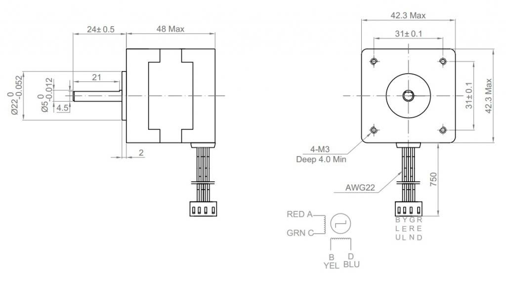

## Motors

The motors in the box are not the same as in the diagram... they're kinda huge, but I had them.

### Wiring
The wiring is in the images

The diagram you see on most of the websites don't line up. I believe that 

| Pin | Color  |
| --- | ------ |
| 1A  | Red    |
| 1B  | Green  |
| 2A  | Yellow |
| 2B  | Blue   |

It might be backwards. We'll work out the wiring.

## Power Supply

I have some industrial power supplies, but they'd take a bit of work to get installed. I think using a [Luxorparts Svitsjet strømaggregat 12 V (DC) 42 W](https://www.kjell.com/no/produkter/elektro-og-verktoy/stromforsyning/stromadaptrer/acdc-stromadapter/fast-utgangsspenning/luxorparts-svitsjet-stromaggregat-12-v-dc-42-w-p45188) and a [DC-kontakt terminalblokk](https://www.kjell.com/no/produkter/elektro-og-verktoy/stromforsyning/stromadaptrer/dc-kontakter/dc-kontakt-terminalblokk-p39984) would be a good idea. They cost about 350NOK together.

## Gears

We have everything from the instructions. But, we since I couldn't find the specific gear they were looking for [GT2 Timing Pulley 16T, 6mm bore](https://www.amazon.com/Timing-Pulley-Bore-Printer-Reprap/dp/B07W17SMGJ) and all I had was 20T, I tried making some on the 3D printing. So in your box, you'll find both the 20T models as well as the printed 16T models.

I think you should try the ones I made, but be careful screwing them in. Since they're plastic, if you tighten the "grub screws" too much, they'll break. I printed 2 more of them, but haven't "tapped the holes" for the grub screws. If you break them, you can learn to make threads :)

## Smooth rods and threaded rods

I believe the smooth rods you have are 32cm and 38cm and the threaded rod is 40cm.

You should consider cutting longer ones to match the instructions. We have 8mm smooth rod and A8 (same as M8, but for rods) in the hallway by the door. 

### Little smooth rods

We have 3 options here.

1) Stick with the drill bits I put in your box

2) "Remix the design" for 4mm smooth rods. This would be a good solution and you and I can do the CAD work together. It's time consuming, but quite easy and interesting.

3) Order 3mm smooth rod from somewhere. I think Elefun as some in carbon which would work. But it's shockingly difficult to get in Norway.

## Arduino

You have the leonardo, but I have a spare classic. Unless the teacher has donated it to you indefinitely, maybe we should use the classic as then you don't have to disassemble the whole thing to give it back or use it again.