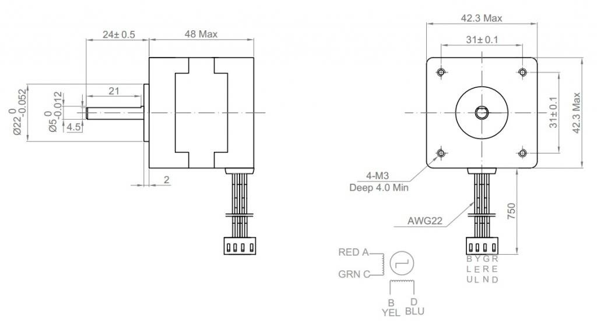
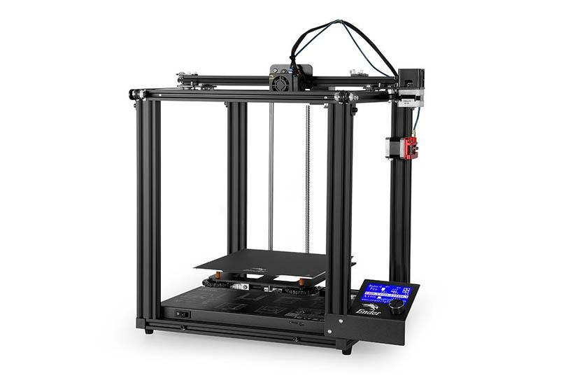
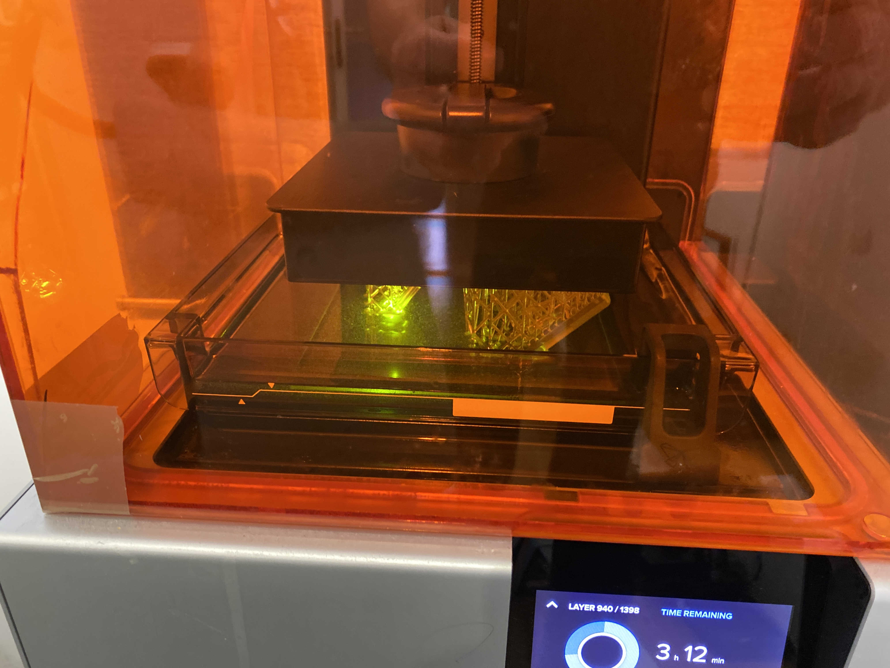
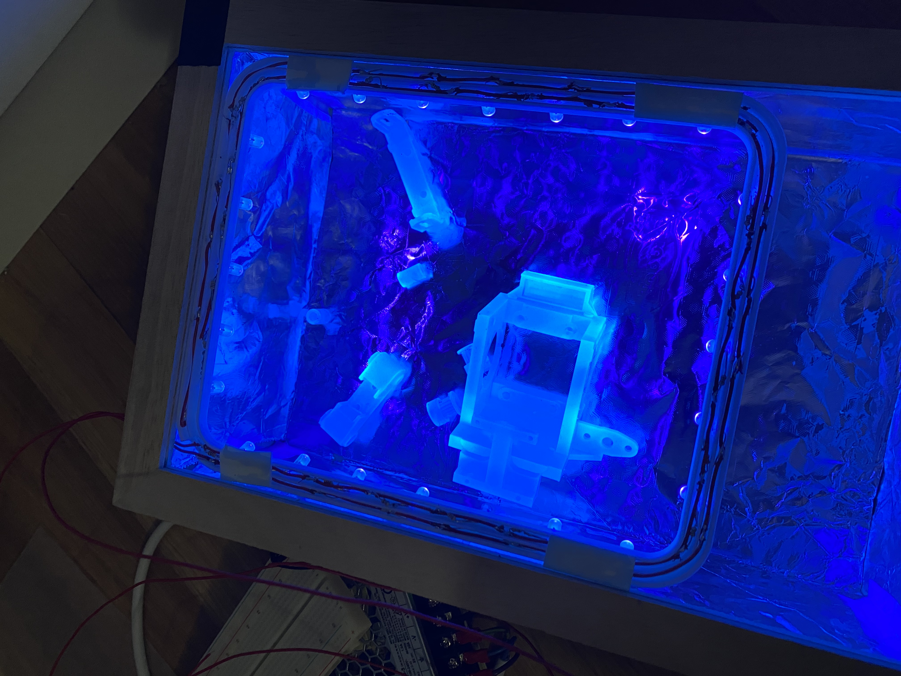

# Pappa's notes

## Motors

The motors in the box are not the same as in the diagram... they're kinda huge, but I had them.

### Wiring
The wiring is in the images

The diagram you see on most of the websites don't line up. I believe that 

| Pin | Color  |
| --- | ------ |
| 1A  | Red    |
| 1B  | Green  |
| 2A  | Yellow |
| 2B  | Blue   |

It might be backwards. We'll work out the wiring.

## Power Supply

I have some industrial power supplies, but they'd take a bit of work to get installed. I think using a [Luxorparts Svitsjet strømaggregat 12 V (DC) 42 W](https://www.kjell.com/no/produkter/elektro-og-verktoy/stromforsyning/stromadaptrer/acdc-stromadapter/fast-utgangsspenning/luxorparts-svitsjet-stromaggregat-12-v-dc-42-w-p45188) and a [DC-kontakt terminalblokk](https://www.kjell.com/no/produkter/elektro-og-verktoy/stromforsyning/stromadaptrer/dc-kontakter/dc-kontakt-terminalblokk-p39984) would be a good idea. They cost about 350NOK together.

## Gears

We have everything from the instructions. But, we since I couldn't find the specific gear they were looking for [GT2 Timing Pulley 16T, 6mm bore](https://www.amazon.com/Timing-Pulley-Bore-Printer-Reprap/dp/B07W17SMGJ) and all I had was 20T, I tried making some on the 3D printing. So in your box, you'll find both the 20T models as well as the printed 16T models.

I think you should try the ones I made, but be careful screwing them in. Since they're plastic, if you tighten the "grub screws" too much, they'll break. I printed 2 more of them, but haven't "tapped the holes" for the grub screws. If you break them, you can learn to make threads :)

## Smooth rods and threaded rods

I believe the smooth rods you have are 32cm and 38cm and the threaded rod is 40cm.

You should consider cutting longer ones to match the instructions. We have 8mm smooth rod and A8 (same as M8, but for rods) in the hallway by the door. 

### Little smooth rods

We have 3 options here.

1) Stick with the drill bits I put in your box

2) "Remix the design" for 4mm smooth rods. This would be a good solution and you and I can do the CAD work together. It's time consuming, but quite easy and interesting.

3) Order 3mm smooth rod from somewhere. I think Elefun as some in carbon which would work. But it's shockingly difficult to get in Norway.

## Arduino

You have the leonardo, but I have a spare classic. Unless the teacher has donated it to you indefinitely, maybe we should use the classic as then you don't have to disassemble the whole thing to give it back or use it again.

# 3D Printing notes

## Normal 3D printer

We printed the parts using the Creality Ender 5 Pro which is a pretty small printer. It can print 220x200x250 millimeters which was good enough for this task. This is the only FDM printer (filament deposition modeling) I have which I haven't hacked to death. It's actually pretty good straight out of the box. I'll make some changes soon, but not until the Ender 5 Plus is properly working.

This printer is much nicer than other printers in its class because it as the print gets heavier, it doesn't cause the bed to wobble from moving back and forth carrying lots of weight. The main problem with this printer is that unless you add some extra support to the bed, it's not stable. So, we use this with some supports holding the bed in place.

### The filament

Ugh!!! The guys we buy filament from [3DNet](https://3dnet.no) stopped getting their good filament and while trying to find a new supplier, they ended up selling some incredibly horrible stuff which just warps like mad.

The material we printed with is the most common material used; PLA (polylactic acid). It's a crappy material which rots with age and is really cheap quality. But it just melts SO WELL. Pretty much anyone can learn to 3D print using PLA, where my normal material PA nylon is extremely difficult. But PLA costs less than 1/4 of what Nylon does and especially for prototypes, it's REALLY simple. It also prints much faster than other materials.

Since it's not a stable polymer, it melts and cools very quickly. This produces very weak parts but again... it's REALLY easy.

Nylon carbon fiber is WAY better, but PLA costs 200NOK for 1KG where BASF brand PA CF15 costs 1000NOK per half kilo. The BASF material would be WAY better for this project and would use much less material. Not only that, but the results would be parts that would need a hammer to scratch.

#### Raft

Since our house was a mess and we couldn't get to the printer, the filament absorbed moisture which makes it very very hard to get to stick to the bed. So I printed your parts using what's called a "raft" which is basically printing a few layers on the print bed that can get messed up before printing the rest on top of it. Since your parts where big and bulky, this worked pretty well.

### Resolution

Since I wanted to make sure your "lunch box" was ready for you, I printed at 0.2mm per layer which is REALLY CRAPPY but a LOT faster than 0.1mm per layer. Once we make the changes to your design, I'm considering printing using Proto Pasta Candy Apple Red which is expensive, but it's beautiful and when we do that, we'll print at either 0.1mm per layer or possibly even less.

### Infill

To make the plastic solid, the people who produced this design assumed everyone would print with crumby materials as we did. The designer of this project recommended 75-90% infill... meaning that rather than a mostly hollow structure, it's almost entirely solid.

## High definition printer

The printer which we're using is the Form Labs Form 2 SLA printer. This printer operates by "curing" resin layer by layer using a 50W ultra violet laser at 405nm wavelength.

Unlike a normal 3D printer (filament deposition), this printer has more or less infinite resolution for the X and the Y access. When you print a circle on this printer, it is an actual circle rather than a polygon with a lot of sides.

For the Z access, when printing the gears, I printed at 25 micrometers (or 0.025 millimeters) per layer. This means that it takes 40 layers to print 1mm.

I printed at the stupidly high resolution since SLA printers do not like printing flat surfaces parallel or perpendicular to the bed. This is because it can cause a vacuum effect that will malform the prints. Also, it tends to make it very difficult to make support structures.

### SLA support structures

SLA support structures are really important since the effect of lifting and lowering the print possibly hundreds of times from a pool of highly viscous fluid can easily stretch the prints. So, by tilting the prints at an angle, it allows a lot more supports to touch the print out.

So, the reason I printed at such a high resolution is that since we couldn't benefit entirely from the inifinite X and Y axis when printing the gear teeth themselves, it was smart to print more layers which would give better results on the teeth of the gears.

### The resin we used

The resin we used is the [Form Labs High Temperature Resin](https://formlabs.com/store/high-temp-resin/) which here in Norway is STUPIDLY EXPENSIVE at approximately 2700NOK per liter. This is why we only printed some small parts with it. Altogether, the parts we printed for this project consumed about 18ml or less than 1/50th of a full liter.

We used the high temp resin rather than a cheaper resin for a few reasons. First of all, it's one of only two high precision resins for the printer. The other one is the one we used for the rocket project. It costs about 2400NOK per liter.

Also, changing resin is very messy. I've decided that high temp resin is my favorite and so long as I use it wisely, it doesn't end up being to expensive to use.

What's cool about this resin is that it's an "Engineering resin" which means that the resolution is EXTREMELY high. It is also able to withstand up to 270 degrees before deforming.

Sadly, the problem with this resin is that it is brittle. Another resin I'm excited about is called Durable Resin 10k which should be almost as strong as cheap aluminum. This would have made stronger gears, but it may not have been good enough in resolution to make the teeth of the gears reasonable.

### Cleaning an SLA print

After you print on an SLA printer, the parts are covered with uncured resin. Sadly, it's impossible to not waste some of it. After all, the re

### Curing the parts

When I decided to try and make the gears rather than shipping them from China, I realized the normal hardness of the print wouldn't be good enough.

The solution was to make sure the resin was fully cured. This means cooking it further under UV light. The Form 2 printer operates at 405nm wavelength (the color of the light, read up on electromagnetic spectrum). I believe the LEDs I'm using are 400nm which is close enough. Very few chemicals require perfect matches.

This design is nothing more than 24 LEDs mounted in a 3D printed frame. The LEDs are each connected to a 150 Ohm 1/16W resistor. The LEDs themselves consume about 20mw (I think) which means that a 1/16W resistor should be good enough.. after all, 1/16 of a watt is 62.5mW. The LEDs are connected in parallel which means that they share the current rather than if they were in serial which would share the voltage.

So, if your bladder is completely full, and you're peeing on the LEDs. If they were in serial, you'd pee on the first one which would splash onto the second, then the third... you'd simply lack the potential to nail them all equally and the result would be a bunch of barely wet LEDs.

If you use the same bladder and stick all the LEDs side by side and pee, you can nail them all at once with equal glory.

We used a separate resistor for each LED, not because we couldn't use a single resistor with 1/16th the resistance. We could easily have used a single 10 Ohm resistor. But first of all, it's just good practice that each LED gets a resistor mounted as close to the LED as possible. This means that the current will travel as smoothly as possible as far as possible before being resisted.

Also, we would have had 16 times the load on the circuit which means the resistor would need to pass 120mw or about an 1/8 of a watt. So, a 10Ohm 1/8th watt resistor would work fine... but if an LED burned out, then we'd increase or decrease the load on the rest of the LEDs... which may or may not cause all the other LEDs to burn out too. Either way... a parallel circuit with independent resistors works really well here.